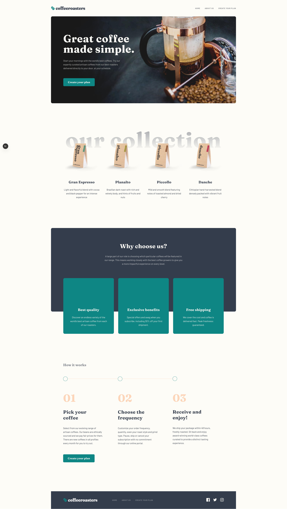

# Frontend Mentor - Coffeeroasters subscription site solution

This is a solution to the [Coffeeroasters subscription site challenge on Frontend Mentor](https://www.frontendmentor.io/challenges/coffeeroasters-subscription-site-5Fc26HVY6). Frontend Mentor challenges help you improve your coding skills by building realistic projects. 

## Table of contents

- [Overview](#overview)
  - [The challenge](#the-challenge)
  - [Screenshot](#screenshot)
  - [Links](#links)
- [My process](#my-process)
  - [Built with](#built-with)
  - [What I learned](#what-i-learned)
  - [Continued development](#continued-development)
  - [Useful resources](#useful-resources)
- [Author](#author)
- [Acknowledgments](#acknowledgments)

**Note: Delete this note and update the table of contents based on what sections you keep.**

## Overview

### The challenge

Users should be able to:

- View the optimal layout for each page depending on their device's screen size
- See hover states for all interactive elements throughout the site
- Make selections to create a coffee subscription and see an order summary modal of their choices
- The app provides specific calculations according to selected by the user options (like weight or frequency of deliveries)
- The order summary text is generated according to the selected options

### Screenshot

### Links

- Solution URL: [GitHub](https://github.com/ortalyarts/frontendmentor-coffeeroasters-subscription-site)
- Live Site URL: [Site preview](https://frontendmentor-coffeeroasters-subscription-site.vercel.app/)

## My process

### Built with

- Semantic HTML5 markup, native CSS3, Javascript ES6
- CSS Animation
- Mobile-first workflow
- PerfectPixel
- [React](https://reactjs.org/) - JS library
- [NextJS](https://nextjs.org/) - React Framework
- [Framer motion](https://motion.dev/) - Animation library
- Accessibility support

## Author

- OrtalyARTS Portfolio Website - [@ortalyARTS.com](https://ortaly.com/)
- Frontend Mentor - [@ortalyARTS](https://www.frontendmentor.io/profile/ortalyARTS)
- Linkedin - [@ortalyARTS](www.linkedin.com/in/ortalyarts) 
